# Tableau Prep Conductor Example

This demo shows you how to use Tableau Prep Builder to work with a Tableau Prep Conductor enabled Tableau Server (Version 2019.1 or later).

# Requirements #

* Tableau Prep Builder
* Tableau Server - enabled with Tableau Prep Conductor or the Data Management Add-on.
* Microsoft SQL Server (or a CSV/Flat File) - In this example MSSQL is used.

# Data Source for Example #

https://www.health.mil/Military-Health-Topics/Technology/Support-Areas/Geographic-Reference-Information/DMIS-ID-Tables

# Instructions #

* Download the latest DMIS ID Monthly Downloads Zip File.
  * Unzip the file into your local project folder.
  * The file name should be something like this: 202006_dmisid_June2020.xlsx
* Insert into a new table on your available Microsoft SQL Server database.

# Open Tableau Prep Builder #

* Start your Prep Flow by connecting to Microsoft SQL Server. 
* Connect to your Tableau Server

# Connect to the SQL Server & Create a new Flow #

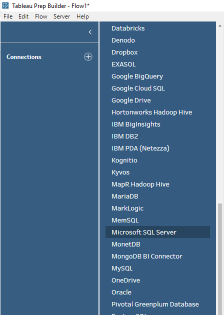

# Build Your Flow #

* Once you've dragged your data source (in this instance ref_dmis) to the flow, create an output object.
  * Change the output destination from 'Save to file' to 'Publish' as a data source.'
  * Set the destination project folder on your Tableau Server.
  * Make sure you use good documentation on your flow for the object name & description since other analysts will see this.

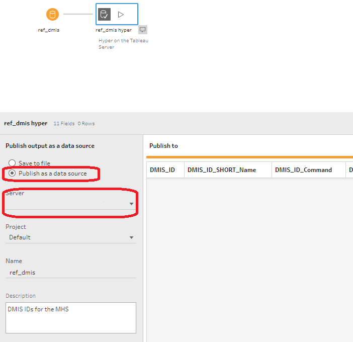

# Execute the Flow #

* It's time to run the flow.   Run it from Tableau Prep Builder on the desktop and verify that the flow works correctly locally before moving onto publishing the flow on the Tableau Server.
* If successful, you will see the hyper output published on the remote server in the destination project. (default in this example)

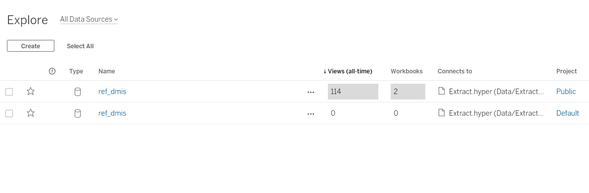

# Publish your flow to the Tableau Server #

* Publish your flow to the Tableau server.  __Note - This is the flow itself, not the data that the flow creates!__
* Prep Builder > Server Menu > Publish Flow (F10)

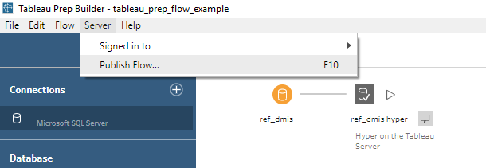

# Check over your flow setup #

* Double check your connection to the MSSQL db.   Use your security best practices.  In this situation the flow (tfl) uses an embedded password.
  * Click 'Edit' next to Connections and double check your 'Authentication' settings. 
  * **IMPORTANT** - IF you are using a Excel/Flat File (CSV) instead of MSSQL, use direct connections instead of uploading the file to the server.
* Once publishes your default browser will open up and you'll see the flow directly in the browser.

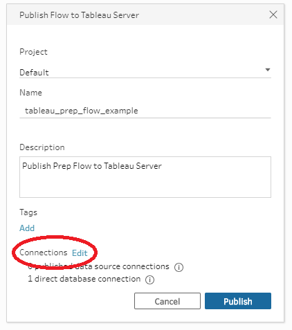

## CSV/Flat File Set Up ##
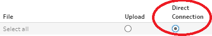

# Check Out Your Flow on the Tableau Server #

Your browser should automatically load the flow on the Tableau server.

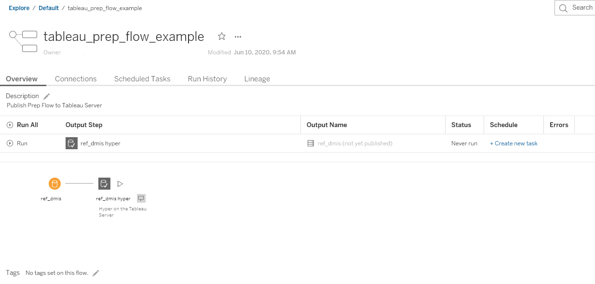

# Execute the Flow on the Tableau Server #

Run the flow directly from the browser.

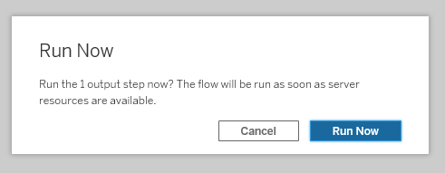

# Watch for the Pending Status #

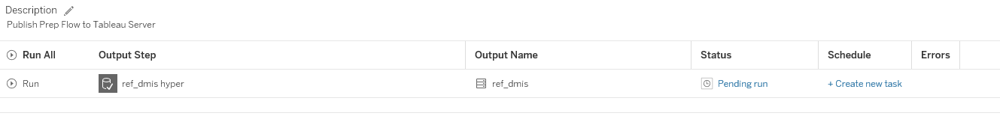

# Flow Error Detected #

Uh oh, we have an error! The flow has failed and likely generated an email to you in your email inbox stating a failed flow run.
Examine your flow and see where the issue is.

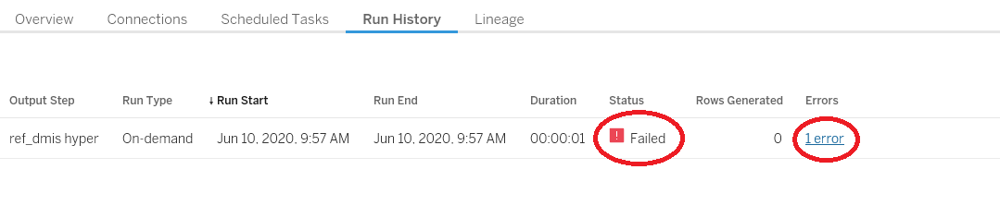

# Check Your Connection to the SQL Server #

* Correct the error by adding a port 1433 to the MSSQL db.   If your MSSQL uses a different port than the default, use that one instead.  Ask your MSSSQL DBA for that information.  But try 1433 first.

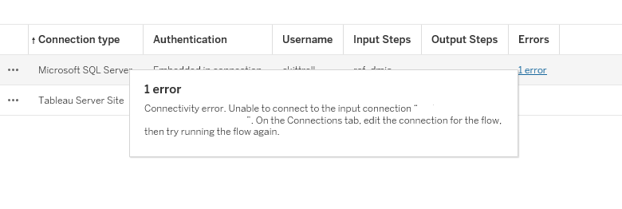

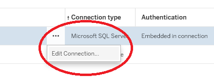

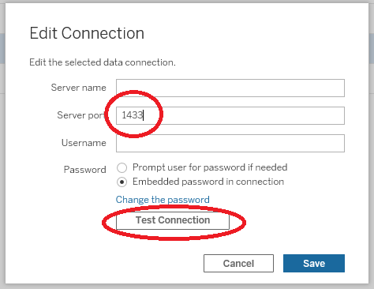

# Test and Verify the Fix #

* Click the test connection button and verify that the Tableau server can successfully reach the MSSQL db.
* Run your flow again and check for a successful run.

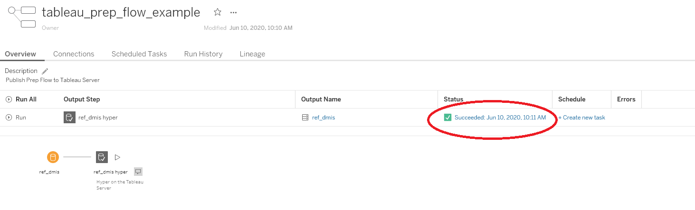

# Set up a Tableau Server Task Scheduler #

* Now that you know that your connection is working, it's time to schedule it to automatically update. Depending on your needs, you may need to set up a separate process to upload the data onto MSSQL.   Tableau Prep Builder 2020 will have new feature capability to export data from an external source to MSSQL, not only hyper or CSV outputs.   

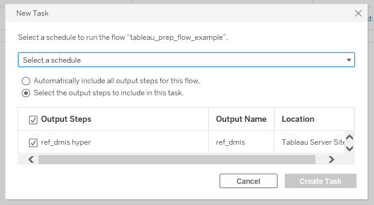

# Optional - Check out your tasks in the Tableau Server Scheduler #

* (Optional) You can see your task that you schedule in the Tableau Tasks.

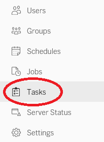

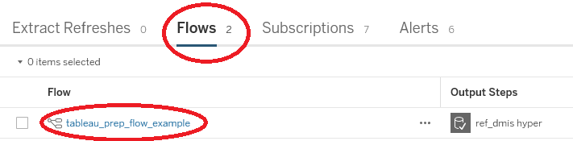

